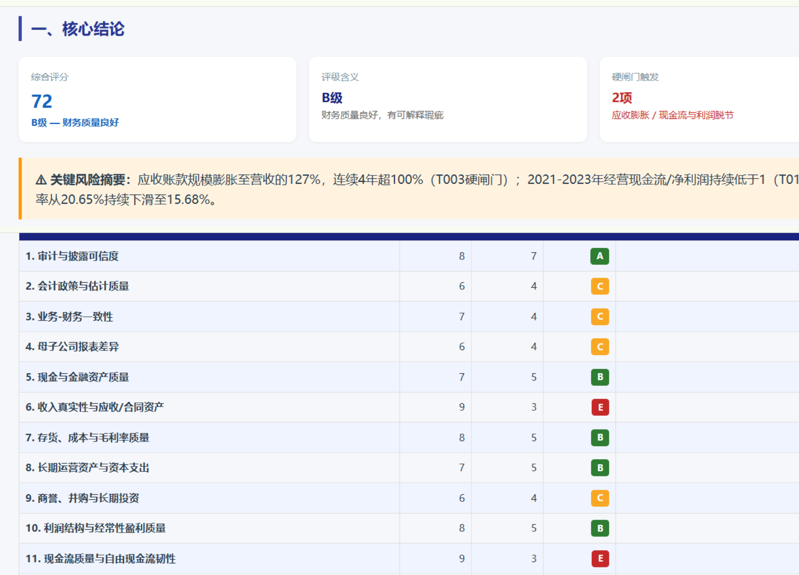

# Financial Report Risk Screening

A reusable agent skill for auditing listed-company financial reports, scoring financial quality, and producing structured red-flag analysis reports.

中文名：上市公司财报排雷 Skill。  
Maintainer: **kwbk** · GitHub: [onekwbk110](https://github.com/onekwbk110)

This repository packages a complete agent workflow for turning annual reports, interim reports, audit notes, and official disclosures into a financial-quality scorecard and red-flag diagnosis. It is designed for agent runtimes that support skill folders with a root `SKILL.md` file, such as Codex-style skill loaders.

The skill does not try to predict stock prices. It helps an agent answer a more basic question first:

```text
Can this company's financial statements be trusted enough to continue researching it?
```

## Preview

Example HTML report output: overall score, hard-gate alerts, and the 15-domain scorecard.

示例输出：综合评分、硬闸门提示与 15 维评分卡。




## Table Of Contents

- [What This Skill Is](#what-this-skill-is)
- [What This Skill Is Not](#what-this-skill-is-not)
- [Who Should Use It](#who-should-use-it)
- [Installation](#installation)
- [How Agents Discover The Skill](#how-agents-discover-the-skill)
- [How To Trigger It](#how-to-trigger-it)
- [Example Prompts](#example-prompts)
- [Expected Inputs](#expected-inputs)
- [Workflow Overview](#workflow-overview)
- [Detailed Workflow](#detailed-workflow)
- [Package Contents](#package-contents)
- [Reference Map](#reference-map)
- [Output Expectations](#output-expectations)
- [Quality Gates](#quality-gates)
- [Safety And Compliance](#safety-and-compliance)
- [Customization](#customization)
- [Requirements](#requirements)
- [Limitations](#limitations)
- [Contributing](#contributing)
- [License](#license)

## What This Skill Is

This is a workflow skill for financial-report red-flag analysis. It teaches an agent how to:

- collect and organize official financial-report evidence
- validate structured financial data against official filings
- check accounting policy, estimate, and presentation comparability
- apply deterministic red-flag screening rules
- score financial quality across 15 domains on a 100-point scale
- distinguish facts, calculations, third-party data, interpretations, and open questions
- generate P0/P1/P2 issue cards
- write a long-form financial red-flag report
- export a polished standalone HTML report
- optionally render a PDF report

In Chinese usage, this is a 财报排雷 workflow. The core idea is not "find a reason to criticize a company"; it is to build a disciplined exclusion and verification process before any valuation or investment discussion.

## What This Skill Is Not

This skill is not:

- a stock recommendation system
- a valuation model
- a price target generator
- a trading signal generator
- a replacement for professional audit work
- a legal conclusion engine
- a data vendor or automatic filing downloader

It identifies risk signals. It should not state fraud, false disclosure, tunneling, or misconduct as fact unless an official regulator, court, exchange, auditor, or company filing has made that finding.

## Who Should Use It

This skill is useful for:

- AI agents that need a reusable financial-report analysis workflow
- investors or researchers screening listed companies
- analysts building repeatable annual-report review processes
- content teams producing educational financial-risk analysis
- product teams building agentic research tools
- Chinese-market researchers who need a 财报排雷 framework

It is especially useful when the user asks about:

- annual-report or interim-report red flags
- financial quality scoring
- earnings-management risk signals
- profit quality, asset quality, or cash-flow quality
- parent-company vs consolidated-report differences
- related-party risk
- governance and disclosure risk
- debt pressure, receivables, inventory, goodwill, capex, R&D capitalization, or non-recurring gains

## Installation

Clone this repository into your agent's skills directory:

```bash
git clone https://github.com/onekwbk110/financial-report-risk-screening.git ~/.codex/skills/financial-report-risk-screening
```

If your runtime uses another skills path, clone it there instead:

```bash
git clone https://github.com/onekwbk110/financial-report-risk-screening.git /path/to/your/skills/financial-report-risk-screening
```

Cursor example:

```bash
git clone https://github.com/onekwbk110/financial-report-risk-screening.git ~/.cursor/skills/financial-report-risk-screening
```

The important requirement is that the skill folder itself contains `SKILL.md` at the root:

```text
financial-report-risk-screening/
  SKILL.md
  references/
```

## How Agents Discover The Skill

The root `SKILL.md` contains YAML frontmatter:

```yaml
name: financial-report-risk-screening
description: Use when analyzing a listed company's annual report for financial-report red flags, financial quality scoring, fraud/earnings-management risk, asset quality, profit quality, cash-flow quality, parent/consolidated report differences, related-party risks, or when producing a standardized 财报排雷 report.
```

Compatible agents use this metadata to decide when to load the skill. After the skill is triggered, the agent reads `SKILL.md`, then loads reference files from `references/` only as needed.

## How To Trigger It

Explicit invocation:

```text
$financial-report-risk-screening
```

Natural-language triggers include requests such as:

- "analyze annual-report red flags"
- "score this company's financial quality"
- "check earnings management risk"
- "review asset quality and cash-flow quality"
- "compare parent-company and consolidated statements"
- "identify related-party risks"
- "produce a 财报排雷 report"
- "基于年报做财务排雷"
- "检查这家公司有没有财务红旗"
- "输出财务质量评分和核心风险问题卡"

## Example Prompts

English:

```text
Use $financial-report-risk-screening to analyze this listed company annual report for financial red flags and produce a polished HTML report.
```

```text
Analyze the last 5 years of annual reports for this listed company. Score financial quality, identify P0/P1/P2 red flags, and create issue cards with evidence.
```

```text
Review this company's asset quality, profit quality, cash-flow quality, related-party exposure, and parent-vs-consolidated statement differences.
```

Chinese:

```text
请用 $financial-report-risk-screening 分析这家上市公司最近 5 年年报，输出财务质量评分、核心风险问题卡和 HTML 报告。
```

```text
请按财报排雷流程检查这家公司有没有应收、存货、商誉、在建工程、研发资本化、关联方和现金流方面的风险。
```

```text
基于官方年报和最新中报，给这家公司做一份长版财报排雷报告，不要只给 dashboard。
```

## Expected Inputs

Minimum input:

- company name or ticker
- market or exchange if ambiguous
- target fiscal year or reporting period if known

Better input:

- annual report PDFs or official filing links
- latest interim report
- company announcements, inquiry replies, restatements, penalties, or auditor-change notices
- peer companies or industry context
- desired output language
- desired output folder
- whether PDF is required

The agent should collect missing public information when it has web access. Official filings and exchange disclosures should override structured data vendors when conflicts appear.

## Workflow Overview

The workflow is evidence-first:

```text
official filings
  -> data validation
  -> accounting comparability checks
  -> deterministic red-flag screening
  -> hard-gate review
  -> 15-domain scoring
  -> P0/P1/P2 issue cards
  -> severe-conclusion red-team review
  -> long-form report
  -> HTML/PDF export and visual QA
```

The workflow is built around four core questions:

1. Can the statements be trusted?
2. Does profit have asset and cash-flow support?
3. Are assets high quality, or are they future write-off carriers?
4. Do operating, management, financial, and governance signals confirm each other?

## Detailed Workflow

### 1. Build An Evidence Pack

Collect 5-10 years of annual reports when possible, plus the latest interim report. Include:

- audit reports
- notes to financial statements
- MD&A
- segment data
- accounting policy or estimate changes
- presentation reclassifications
- related-party disclosures
- guarantees
- litigation
- pledges
- regulatory inquiries
- penalties
- restatements and corrections
- auditor changes

Structured data tools such as iWenCai, Wind, Eastmoney, Tushare, Bloomberg, FactSet, or other vendors can be used as a speed layer, but official filings remain the final authority.

### 2. Understand The Business Before Scoring

Before calculating ratios, the agent should map:

- products and services
- revenue model
- customers and channels
- suppliers
- geography
- capacity and utilization
- production and sales volume
- pricing and cost drivers
- industry cycle
- nonfinancial KPIs

Financial red flags are more meaningful when tested against the operating model.

### 3. Run Deterministic Red-Flag Rules

Use `references/deterministic-red-flag-rules.md` as a fast screening layer. Trigger examples include:

- revenue grows but operating cash flow weakens
- receivables or contract assets grow faster than revenue
- inventory grows faster than sales
- goodwill or long-lived assets become large relative to equity or profit
- capitalized R&D rises while expense recognition drops
- non-recurring gains support reported profit
- parent-company cash or profit diverges sharply from consolidated results
- related-party transactions become central to revenue, procurement, financing, or cash management

Rule hits are investigation triggers, not final conclusions.

### 4. Validate Data And Source Hierarchy

Use `references/risk-control-protocol.md` before scoring. The agent should reconcile:

- revenue
- net profit attributable to parent
- recurring or adjusted profit where applicable
- operating cash flow
- monetary funds
- interest-bearing debt
- receivables and contract assets
- inventory
- goodwill
- fixed assets and construction in progress
- capital expenditure
- related-party balances and transactions

Evidence should be classified as:

- confirmed fact
- calculated fact
- third-party data
- interpretation
- open question

### 5. Check Accounting Comparability

Use `references/accounting-policy-change-protocol.md`. Before interpreting changes in margins, expenses, cash flow, or assets, check:

- accounting policy changes
- accounting estimate changes
- new accounting-standard adoption
- prior-period corrections
- presentation reclassifications
- restated comparative figures

If a metric cannot be bridged across accounting changes, mark it as not comparable or unresolved.

### 6. Apply Hard Gates

Use `references/scoring-system.md`. Hard gates can cap the final rating before detailed scoring. Examples may include:

- adverse audit opinion
- disclaimer of opinion
- serious internal-control issues
- major restatement
- official regulatory finding
- major unresolved data conflict
- material going-concern uncertainty

The skill is conservative: severe conclusions require strong evidence.

### 7. Score 15 Domains

Use the 100-point scoring model in `references/scoring-system.md`. The scoring should be evidence-based and explain deductions.

The score should help answer:

- whether the company can continue to be researched
- which issues need deeper verification
- whether risk signals are isolated or systemic
- whether the conclusion should be "continue research", "major discount/review required", or "exclude by principle"

### 8. Generate Issue Cards

Use `references/red-flag-playbook.md`. Each important P0/P1/P2 issue should get its own card:

- trigger evidence
- why the account matters
- business explanation test
- accounting explanation test
- cash-flow test
- asset-side trace
- likely causes
- follow-up verification
- score impact

The goal is to make the analysis auditable, not just persuasive.

### 9. Run Severe-Conclusion Review

If the rating is D/E, any P0 exists, or the final judgment is severe, use the red-team checklist in `references/risk-control-protocol.md`.

Strong language should be softened unless the evidence is official and specific. For example:

- prefer "risk signal" over "fraud"
- prefer "requires verification" over "confirmed issue"
- prefer "cannot be resolved from public data" over "concealed"

### 10. Write The Long-Form Report

Use `references/report-template.md` and `references/long-form-report-standard.md`.

The report should not be a thin dashboard. It should include:

- conclusion-first summary
- score and rating
- hard-gate state
- top red flags
- source basis
- global business and financial story
- three-statement synthesis
- account-level red-flag map
- issue cards
- scoring explanation
- follow-up checklist
- source and method appendix

Account-level analysis should connect back to the overall thesis. A good report lets the reader understand the company first, then inspect specific accounts such as cash, debt, receivables, inventory, goodwill, fixed assets, construction in progress, R&D capitalization, impairment, investment income, non-recurring gains, and operating cash-flow adjustments.

### 11. Export Deliverables

Default output:

- standalone HTML report
- Markdown source report
- source index
- validation log or calculation notes

Optional output:

- PDF report
- archived official filings
- workpapers
- reproducibility script or command notes

HTML should be visually inspected before delivery. Fix broken tables, clipping, mobile overflow, unreadable charts, missing glyphs, and overlapping text.

## Package Contents

```text
financial-report-risk-screening/
  SKILL.md
  LICENSE
  README.md
  references/
    accounting-policy-change-protocol.md
    deterministic-red-flag-rules.md
    html-export-standards.md
    long-form-report-standard.md
    market-adapters.md
    pdf-export-standards.md
    red-flag-playbook.md
    report-template.md
    risk-control-protocol.md
    scoring-system.md
```

## Reference Map

| File | Purpose |
|---|---|
| `SKILL.md` | Main trigger, workflow, output rules, and reference navigation |
| `references/scoring-system.md` | 15-domain, 100-point scoring model and hard gates |
| `references/deterministic-red-flag-rules.md` | Mechanical screening rules for fast initial detection |
| `references/red-flag-playbook.md` | P0/P1/P2 issue-card structure and investigation playbooks |
| `references/risk-control-protocol.md` | Evidence hierarchy, conclusion controls, and red-team review |
| `references/accounting-policy-change-protocol.md` | Accounting policy, estimate, restatement, and presentation-change checks |
| `references/market-adapters.md` | A-share, Hong Kong, US-listed, A+H, and Chinese ADR considerations |
| `references/report-template.md` | Standard report sections and writing structure |
| `references/long-form-report-standard.md` | Long-form report depth and account-level decomposition standard |
| `references/html-export-standards.md` | Standalone HTML layout, visual, and QA requirements |
| `references/pdf-export-standards.md` | Optional PDF rendering and visual inspection standards |

## Output Expectations

A complete run should normally produce:

```text
<output-root>/<company>_<ticker>/
  01_final_report/
    <company>_<ticker>_财报排雷报告.md
    <company>_<ticker>_财报排雷报告.html
    <company>_<ticker>_财报排雷报告.pdf        # optional
  02_official_filings/
    annual reports, interim reports, announcements
  03_workpapers_validation/
    source_index.md
    validation_log.md
    extraction_notes.md
    generation_notes.md or reproducibility script
```

The report should clearly separate:

- confirmed facts
- calculated facts
- third-party data
- interpretation
- open questions

## Quality Gates

Before final delivery, the agent should verify:

- official filing values reconcile with structured data for core metrics
- accounting comparability has been checked before judging anomalies
- parent-company and consolidated statements are not mixed accidentally
- ratios include formulas, units, periods, and source basis
- every severe conclusion is supported by official evidence or softened
- P0/P1/P2 labels match the evidence threshold
- tables and charts are traceable to sources
- HTML renders locally
- Chinese text renders correctly when Chinese output is used
- tables do not overflow on narrow screens
- final limitation statement appears near the top and bottom

## Safety And Compliance

This skill identifies risk signals. It must not state fraud, false disclosure, tunneling, money occupation, or misconduct as fact unless an official regulator, court, exchange, auditor, or company filing has made that finding.

Reports should include a limitation statement such as:

```text
仅供学习研究，不构成投资建议。
```

Avoid unsupported language such as:

- "fraud"
- "fake revenue"
- "fabricated profit"
- "tunneling"
- "money occupation"
- "malicious concealment"

Preferred language:

- "risk signal"
- "requires verification"
- "cannot be resolved from public data"
- "strong inconsistency"
- "possible earnings-management room"
- "high-priority due-diligence question"

For external publication, use stricter source citations, calculation notes, limitation statements, and legal/reputational wording review.

## Customization

You can customize the workflow without changing the core skill:

- Provide an output folder in the user prompt.
- Override the default report author `kwbk` with another author or organization name if needed.
- Ask for English or Chinese output.
- Ask for HTML only, or HTML plus PDF.
- Provide a brand template or previous report as a style reference.
- Provide market-specific data sources or filing portals.
- Provide peer companies for comparison.

If you want to modify the skill itself:

- Keep `SKILL.md` concise.
- Put detailed methods in `references/`.
- Keep official filings as the highest source authority.
- Preserve the distinction between risk signals and official findings.
- Validate the skill after changes with your runtime's skill validator if available.

## Requirements

This repository contains workflow instructions and reference materials. It does not bundle a data vendor, PDF parser, browser, or filing downloader.

The executing agent should have tools for:

- web search or official filing retrieval
- PDF/text extraction
- spreadsheet or table handling when needed
- financial statement normalization
- HTML generation
- browser-based visual inspection
- optional PDF rendering

Useful but not required:

- access to structured financial databases
- exchange announcement search
- OCR for scanned PDFs
- local browser automation for visual QA
- spreadsheet export support

## Limitations

This skill can improve consistency, but it cannot guarantee that public data reveals all problems.

Common limitations:

- official filings may omit operational details needed for full verification
- structured data vendors may disagree with filings
- accounting standards differ across markets
- segment disclosure may be insufficient
- industry-specific metrics may require additional domain knowledge
- severe claims require official evidence
- external publication may require legal or compliance review

If public data cannot resolve a question, the report should say so explicitly.

## Contributing

Useful contributions include:

- new market adapters
- industry-specific red-flag rules
- additional issue-card playbooks
- improved HTML templates
- test prompts and sample outputs
- validation scripts
- filing-source retrieval helpers

When contributing, avoid adding private filings, credentials, or proprietary data. Keep examples anonymized or based on public official disclosures.

## License

MIT License. Copyright (c) 2026 kwbk. See [LICENSE](LICENSE).
